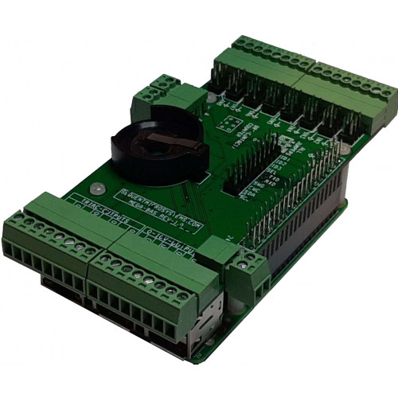

[](https://www.sequentmicrosystems.com)

# megabas-rpi

This is the command to control [Building Automation Stackable Card for Raspberry Pi](https://sequentmicrosystems.com/products/building-automation-8-layer-stackable-hat-v4-for-raspberry-pi)



## Setup

Don't forget to enable I2C communication:
```bash
~$ sudo raspi-config
```

## Usage

```bash
~$ git clone https://github.com/SequentMicrosystems/megabas-rpi.git
~$ cd megabas-rpi/
~/megabas-rpi$ sudo make install
```

Now you can access all the functions of the BAS board through the command "megabas". Use -h option for help:
```bash
~$ megabas -h
```
 ## Command line update
If you clone the repository, any update can be made with the following commands:

```bash
~$ cd megabas-rpi/  
~/megabas-rpi$ git pull
~/megabas-rpi$ sudo make install
```
## Software selectable input type

For cards version 5.0 and up, input types are not selectable from the dipswitches but from the software. 
The default setting of the Inputs type is 0-10V, to change it:

 1) Make sure you have the latest software installed, as explained above
 2) Run the command ```megabas <stack> incfgwr <channel> <value>```, where
* stack = 0 - 7, Stack level selectable from ID0, ID1, ID2 dipswitches
* channel = 1 - 8, Channel number you need to modify
* value = 0 for 0-10V, 1 for 1K Thermistor or Dry contact, 2 for 10K Thermistor

For more info on the commands parameters ```megabas -h incfgwr``` and ```megabas -h incfgrd```

[Python Library](python/README.md)

[Firmware update instructions](update/README.md).

[Node-RED](https://github.com/SequentMicrosystems/megabas-rpi/tree/master/node-red-contrib-sm-bas)

[CODESYS Driver](https://github.com/SequentMicrosystems/megabas-rpi/tree/master/CODESYS)

The board can act as Modbus RTU slave device, checkout [modbus instructions](MODBUS.md)
